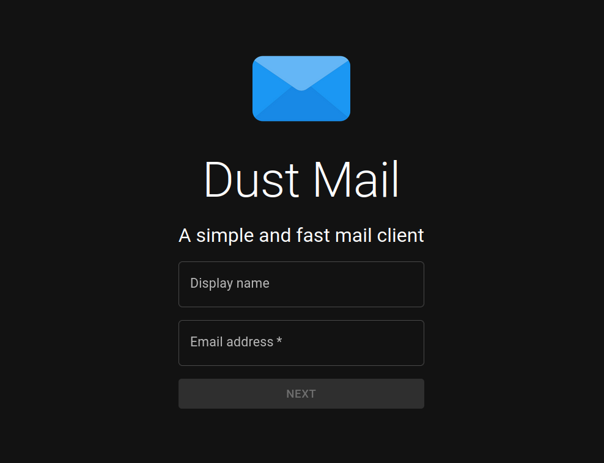

# Dust-Mail Web/Desktop

## Description

This is a simple email application built in Rust. It provides a convenient way to manage and send emails efficiently. For more info, read the [docs](https://docs.dust.email)

## Features

- **User-friendly Interface**
  - Intuitive and easy-to-use interface for seamless email management.
- **Compose Emails**
  - Compose and send emails to multiple recipients.
- **Inbox**
  - View and organize incoming emails in a neatly organized inbox.
- **Read/Reply/Forward**
  - Read, reply to, and forward emails within the app.
- **Attachments**
  - Attach files to emails for easy sharing.
- **Search**
  - Search for specific emails or keywords within your inbox.
- **Folders**
  - Create custom folders to organize your emails.
- **Mark as Read/Unread**
  - Keep track of read and unread emails with a simple toggle.
- **Delete/Archive**
  - Easily delete or archive emails to keep your inbox clutter-free.
- **Settings**
  - Customize the app's preferences to suit your needs.

## Screenshots

Here are some screenshots of the application:

1. 
2. 

Feel free to explore the app and provide any feedback or suggestions you may have. Enjoy using our email app built in Rust!

## Installation

To install and run the email app, follow these steps:

1. Clone the repository:

```sh
git clone https://github.com/Dust-Mail/desktop dust-mail-desktop
```

2. Go into the directory

```sh
cd dust-mail-desktop
```

3. Install dependencies

```sh
pnpm install
```

4. Build the application

```sh
pnpm run tauri build
```

You should now find your application in the `src-tauri/target/release` directory.
